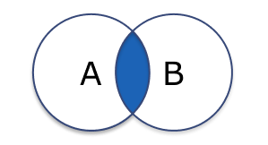
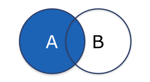
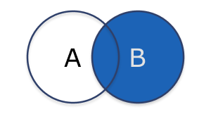
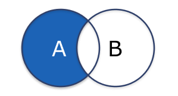
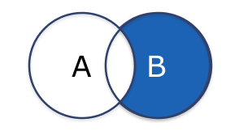
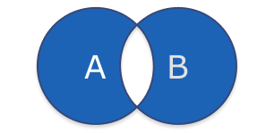

# SQL JOINGS
Theory:

https://en.wikipedia.org/wiki/Join_(SQL)

https://www.postgresqltutorial.com/postgresql-tutorial/postgresql-joins/

https://dirask.com/posts/PostgreSQL-JOIN-list-SQL-Query-D6Bl6D

https://www.tutorialspoint.com/postgresql/postgresql_using_joins.htm

https://www.geeksforgeeks.org/postgresql-joins/

</img> INNER JOIN   

</img>  LEFT JOIN   

</img> RIGHT JOIN

</img> FULL OUTER JOIN 

</img> LEFT OUTER JOIN EXCLUSIVE

</img> RIGHT OUTER JOIN EXCLUSIVE

</img> FULL OUTER JOIN EXCLUSIVE

